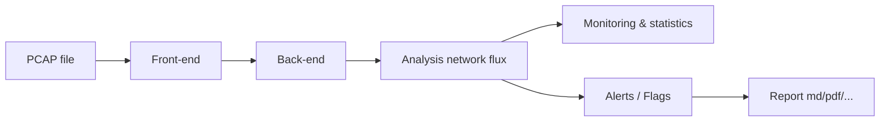

# networks-flux-analyzer

Application to help you, in forensic phases, to analyse networks flux.

## Features

*Analysis step: detect malicious patterns or flag user settings*

Optional: 
- network capture module to create pcap file from network interface and send automatically to the API (Rust module using eBPF XDP).
- Add IA in detection patterns.

## Technos

- Front-end: React or Vue.js or Angular
- Back-end/network analysis: Python or we split Back-end and network analysis in two different services ?
- Database: (SQL or NoSQL ?)

