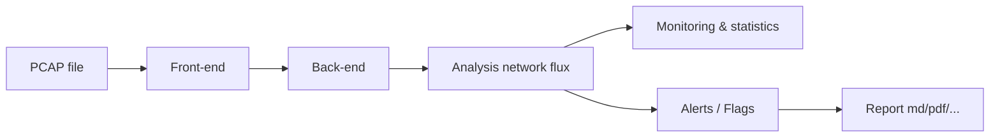

# networks-flux-analyzer

Application to help you, in forensic phases, to analyse networks flux.

## Features

*Analysis step: detect malicious patterns or flag user settings*

Optional: 
- network capture module to create pcap file from network interface and send automatically to the API.
- Add IA in detection patterns.

## Technos

- Front-end: React
- Back-end/network analysis: Python
- Database: (SQL or NoSQL ?)

